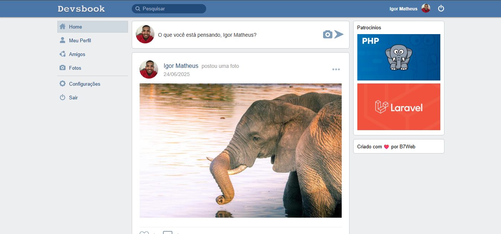

<h1> Devsbook</h1>




Devsbook é uma rede social simples e funcional, desenvolvida com PHP puro, que permite aos usuários se conectarem, postarem atualizações, curtirem e comentarem publicações — uma versão minimalista do Facebook, feita para fins de aprendizado e demonstração de habilidades em desenvolvimento web.

## 🧠 Funcionalidades

- Cadastro e login de usuários
- Edição de perfil (incluindo foto/avatar)
- Publicação de textos e imagens
- Feed de notícias com ordenação por data
- Sistema de curtidas e comentários
- Página de perfil com linha do tempo pessoal
- Sistema de seguidores (seguir/deixar de seguir)
- Upload e redimensionamento automático de imagens
- Busca por outros usuários


## 🛠️ Tecnologias e ferramentas utilizadas

- **PHP 7+**
- **MySQL**
- **HTML5, CSS3 e JavaScript**
- **AJAX (fetch com async/await)**
- **Arquitetura MVC (manual, sem frameworks)**
- **Composer (para autoloading de classes)**

<br/>


## 🚀 Como executar o projeto localmente

1. Clone este repositório:
   ```bash
   git clone  https://github.com/DeveloperIgorM/devsbook.git
   cd devsbook
   ```
<br/>


## 📁 Estrutura do projeto

```bash
/public
├── /assets
│   ├── /css
│   ├── /images
│   └── /js
├── /media
├──.htaccess
├──index.php


/src
├── /controllers
├── /handlers
├── /models
├── /views
│    ├── /pages
│    └── /partials
│
├──Config
├──routes

/vendor

```
<br/>

## 👨🏾‍💻 Autor

### Desenvolvido por Igor Matheus 👽

## 📝 Licença

Este projeto está licenciado sob a MIT License.
Você pode usá-lo, modificá-lo e compartilhar livremente.

